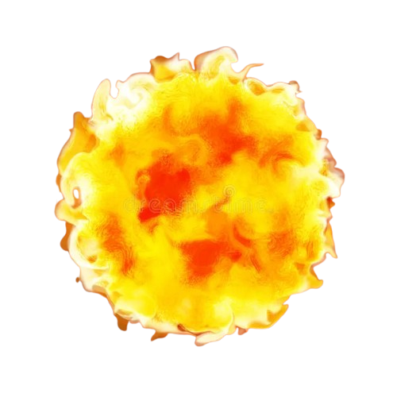
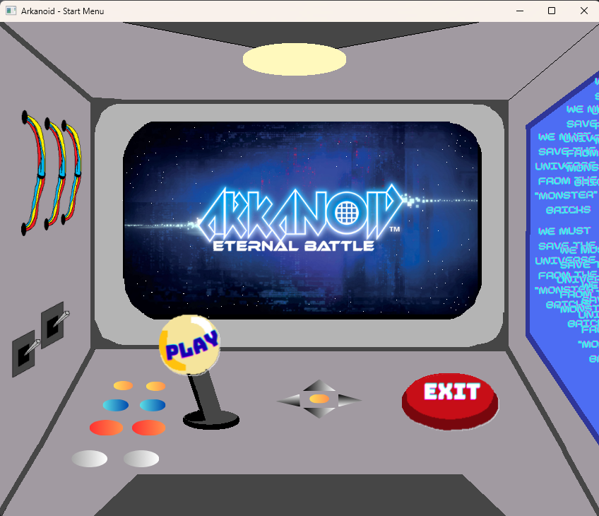
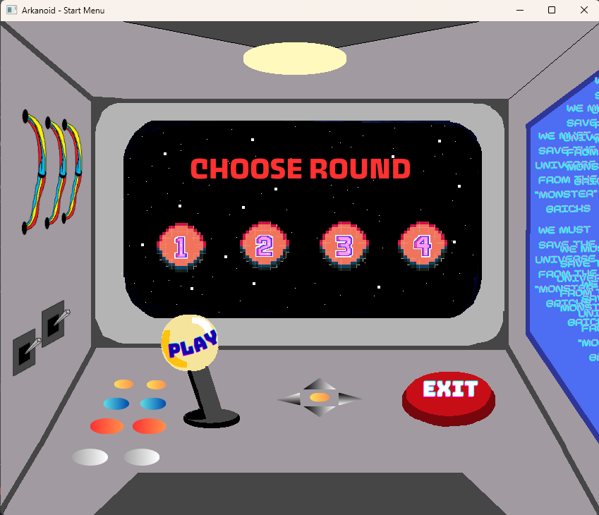
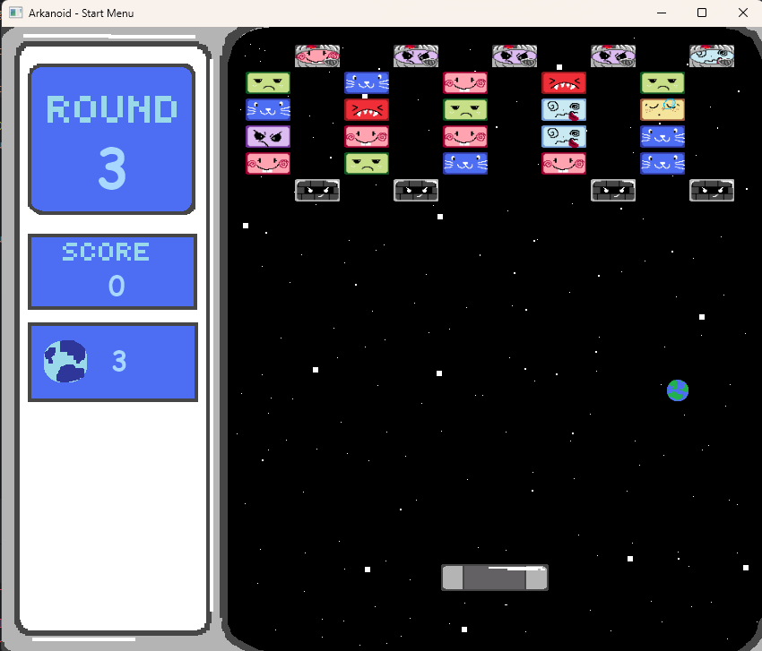
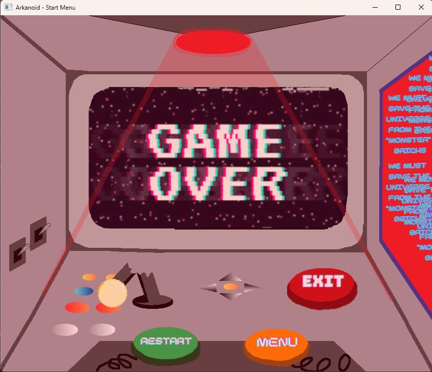
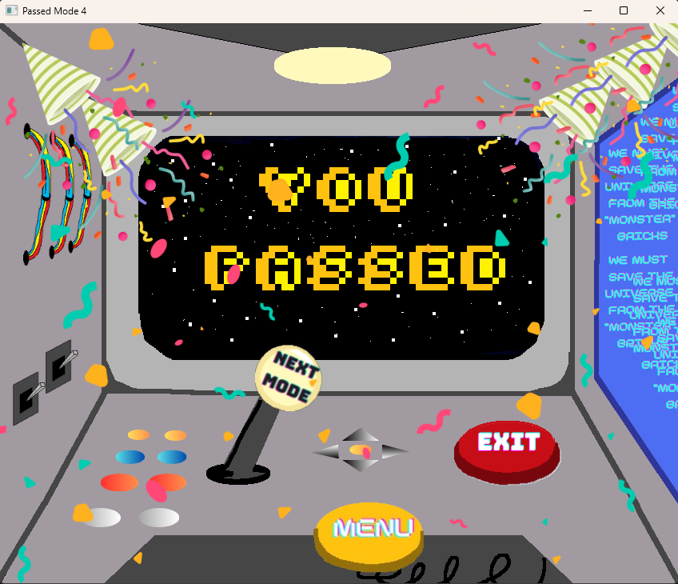

# Arkanoid Game - Object-Oriented Programming Project
## Author
Group 16 - Class INT2204_1

1. Nguyễn Huyền Anh - 24020016  
2. Nguyễn Đình Tiến Dũng - 24020088   
3. Lâm Thùy Ngân - 24020250   

**Instructor:** Kiều Văn Tuyên, Vũ Đức Hiếu  
**Semester:** [HK1 - Năm học 2025]

---

## Description
This is a classic Arkanoid game developed in Java as a final project for Object-Oriented Programming course. The project demonstrates the implementation of OOP principles and design patterns.

**Key features:**

1. The game is developed using Java 17+ with JavaFX for GUI.
2. Implements core OOP principles: Encapsulation, Inheritance, Polymorphism, and Abstraction.
3. Applies multiple design patterns: Singleton, Observer, Factory, Factory Method and Strategy.
4. Uses JavaFX AnimationTimers for smooth gameplay and responsive UI.
5. Includes sound effects, animations, and power-up systems.

**Game mechanics:**

- Control a paddle to bounce a ball and destroy bricks
- Collect power-ups for special abilities
- Progress through multiple levels with increasing difficulty
- Score points for each destroyed brick

---

## UML Diagram
### Class Diagram

---

## Design Patterns Implementation

### 1. Singleton Pattern
**Used in:** Soundmanager1, MusicClickController, MusicMenuController

**Purpose:** Ensure only one instance exists of the class throughout the application, allowing centralized control of sounds and avoiding multiple conflicting instances.

### 2. Observer Pattern
**Used in:** BallManager, ItemManager

**Purpose:** Implements a simple observer-like behavior where ItemManager notifies BallManager when an item effect should be applied. This decouples the item logic from the ball logic, allowing responsive updates to game state without tight coupling.
### 3. Factory Method Pattern
**Used in:** BrickManager subclasses

**Purpose:** Allow subclasses to define the creation of objects without specifying the exact class of the object.
### 4. Abstract Factory Pattern
**Used in:** ItemManager 

**Purpose:** Provides an interface for creating related objects (Items) without specifying their concrete classes. This separates item creation from game logic, making it easier to add new item types or change item behavior without modifying core game code.
### 5. Strategy Pattern
**Used in:** Power-up behaviors for balls and paddle (PowerUpPaddle, PowerUpBall)

**Purpose:** Encapsulates algorithms or behaviors into separate classes that can be swapped at runtime. This allows the game to dynamically change ball or paddle behavior when different power-ups are activated without modifying the core game loop.

---

## Multithreading Implementation
The game primarily runs on the JavaFX Application Thread. AnimationTimer is used to update game logic and render graphics. Audio is handled asynchronously using AudioClip and MediaPlayer. No separate threads are manually created for the game loop, rendering, or I/O operations.

---

## Installation
1. Clone the project from the repository.
2. Open the project in the IDE.
3. Run the project.
## Usage
### Controls
| Key   | Action                                      |
|-------|---------------------------------------------|
| ←     | 	Move paddle left                           |
| →     | 	Move paddle right                          |
| ESC   | 	Pause game                                 |
| SPACE | Activate ball special effect (if available) |
### How to Play
1. Start the game: Click "Play" from the start menu to play or "Exit" to quit.
2. Select a round: After click "Play", choose a round by click on the number of the round you want to play.
3. Control the paddle: Use arrow keys to move left and right.
4. Launch the ball: The ball is launched automatically from the paddle.
5. Destroy bricks: Bounce the ball to hit and destroy bricks.
6. Collect power-ups: Catch falling power-ups for special abilities.
7. Avoid losing the ball: Keep the ball from falling below the paddle. You have 3 lives. If the ball falls below the paddle 3 times, you lose the game.
8. Complete the round: Destroy all destructible bricks to advance.
### Power-ups
| Icon                                                               | 	Name                  | 	Effect                                                                 |
|--------------------------------------------------------------------|------------------------|-------------------------------------------------------------------------|
|                   | 	Multi-Ball            | 	Spawns 2 additional balls from the paddle                              |
|     | 	Paddle Expand         | 	Increases paddle width by 1.5× for 8 seconds                           |
|       | 	Speed Boost           | 	Increases ball speed for 10 seconds                                    |
| 	 | Ghost / Piercing Ball	 | Ball passes through bricks for 10 seconds                               |
| 	                 | Explosion Ball	        | Destroy nearby bricks within 100px when SPACE is pressed, 2 charges max |

### Scoring System
- Brick: 1 point
- Explosive Brick: 500 points + nearby bricks
- Collecting items indirectly increases score when bricks are destroyed
- No combo multipliers implemented

---

## Demo
### Screenshots
**Start Menu**  

**Choose Round**  

**Screen Game**

**Game Over**

**Game Passed**

**Game Demo**
https://drive.google.com/file/d/1R-Mr_roQnqdweHQ5q-aMbHl27Acdo_WH/view?usp=sharing

---

## Future Improvements
### Planned Features
1. **Additional game modes**
- Time attack mode 
- Survival mode with endless levels
- Co-op multiplayer mode
2. **Enhanced gameplay**
- Boss battles at end of worlds
- More power-up varieties (freeze time, shield wall, etc.)
- Achievements system
3. **Technical improvements**
- Migrate to LibGDX or JavaFX for better graphics
- Add particle effects and advanced animations
- Implement AI opponent mode
- Add online leaderboard with database backend

---

## Technologies Used
| Technology | 	Version | 	Purpose        |
|------------|----------|-----------------|
| Java       | 	17+	    | Core language   |
| JavaFX     | 	19.0.2  | 	GUI framework  |
| Maven	     | 3.9+     | 	Build tool     |
| Jackson    | 	2.15.0	 | JSON processing |

---

## License
This project is developed for educational purposes only.

**Academic Integrity:** This code is provided as a reference. Please follow your institution's academic integrity policies.

---

## Notes
- The game was developed as part of the Object-Oriented Programming with Java course curriculum.
- All code is written by group members with guidance from the instructor.
- Some assets (images, sounds) may be used for educational purposes under fair use.
- The project demonstrates practical application of OOP concepts and design patterns.

---

*Last updated: 10/11/2025*